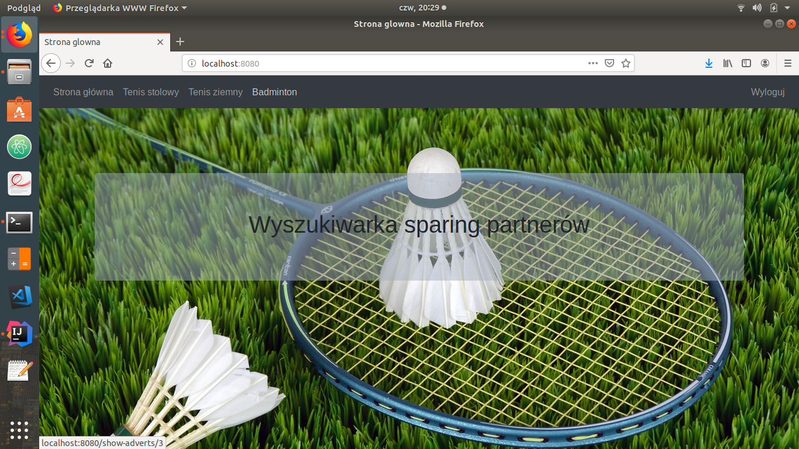
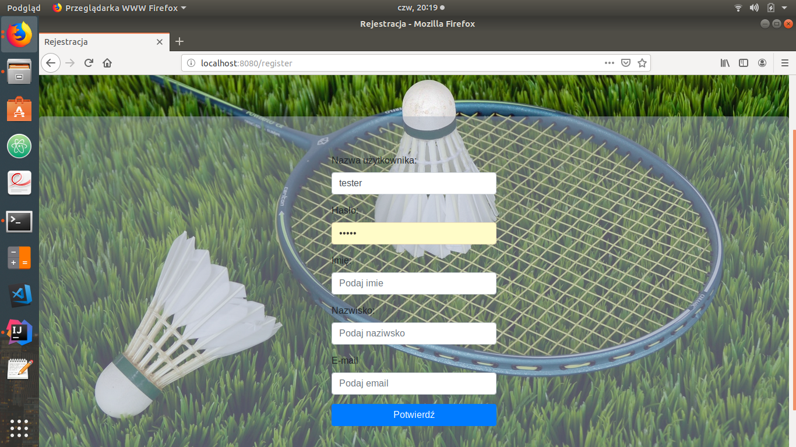
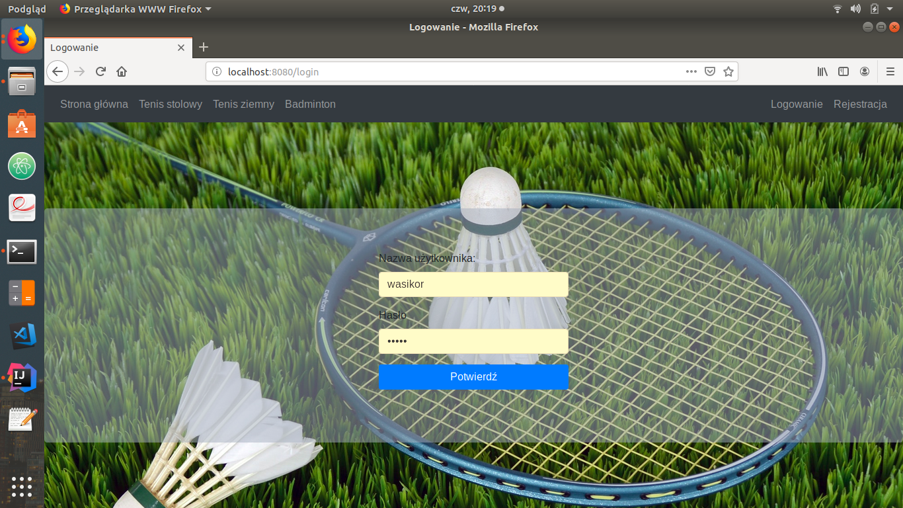
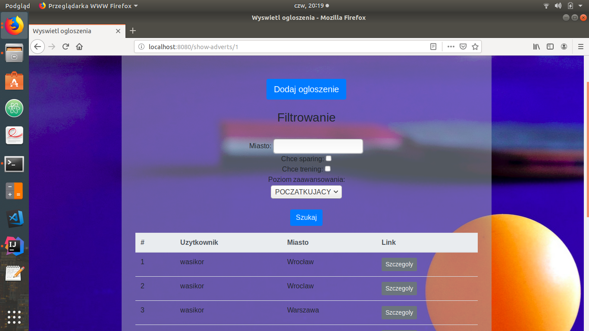
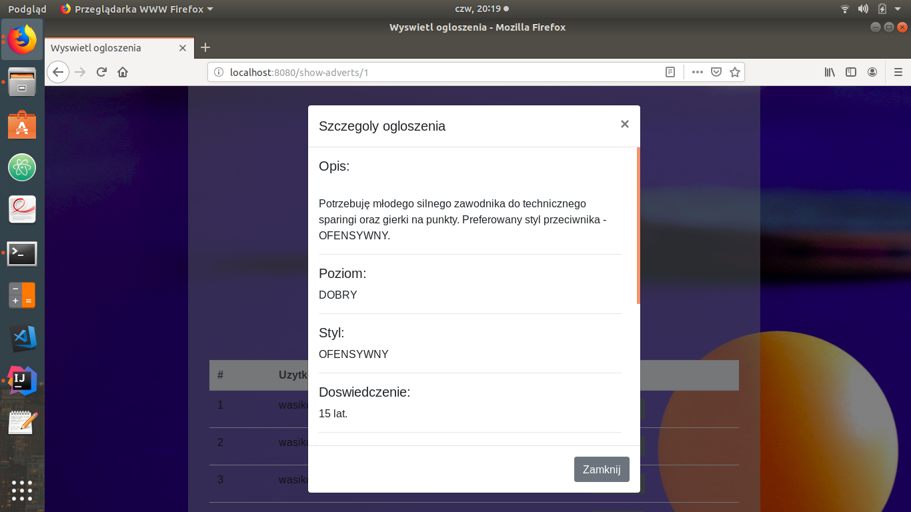
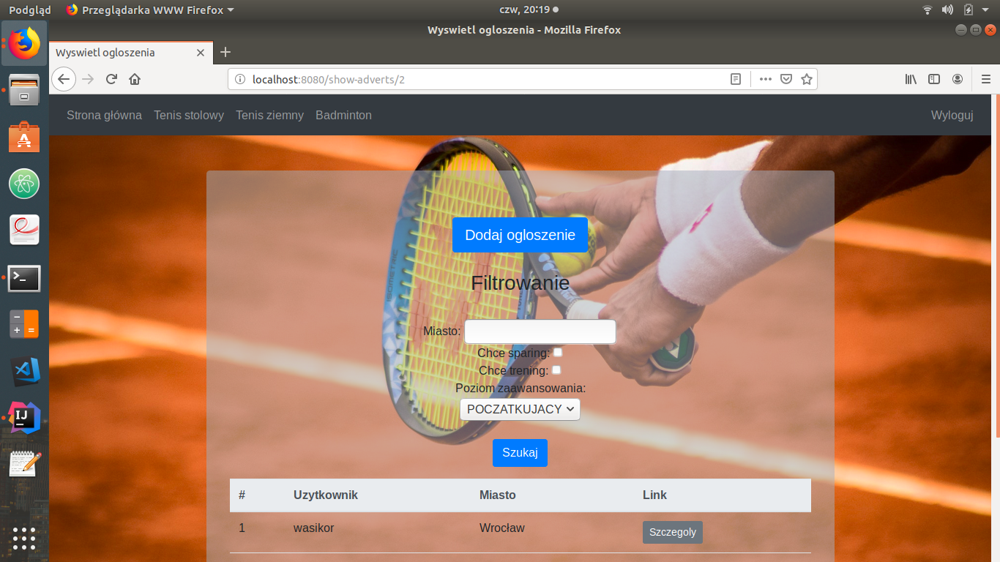
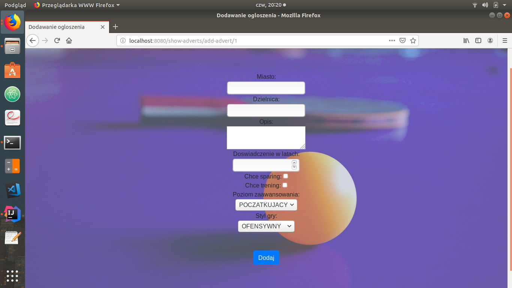

# Sparing-partner-searcher
Wyszukiwarka sparing-partnerów w tenisie, tenisie stołowym i badmintonie. Spring Boot, MVC, Security, Hibernate.

Główne cele to działający back-end, front-end jest mniej istotny.

Oficjalne screen-shoty aplikacji:

